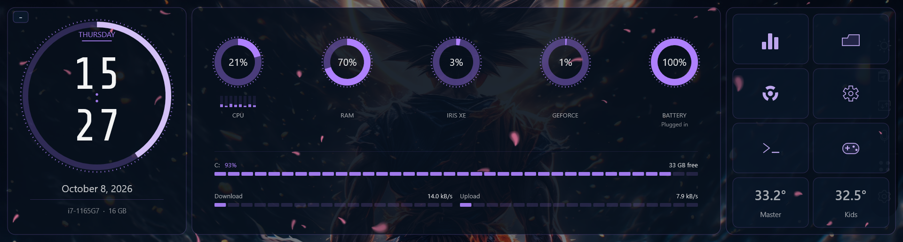
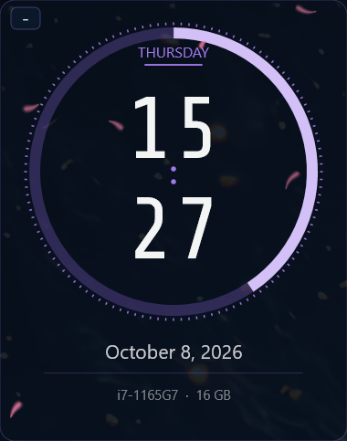
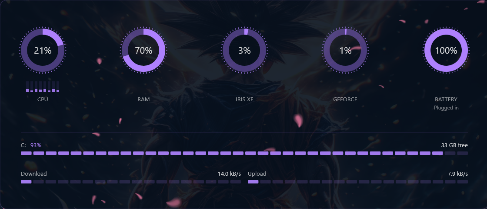
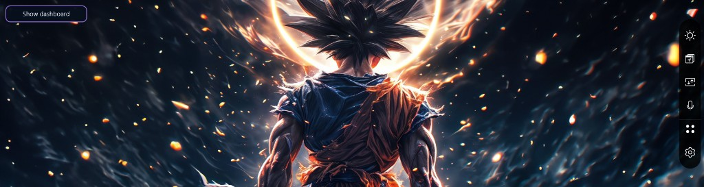
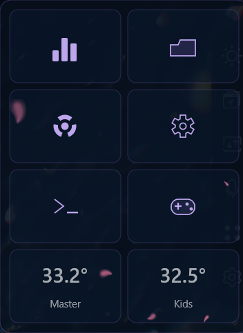
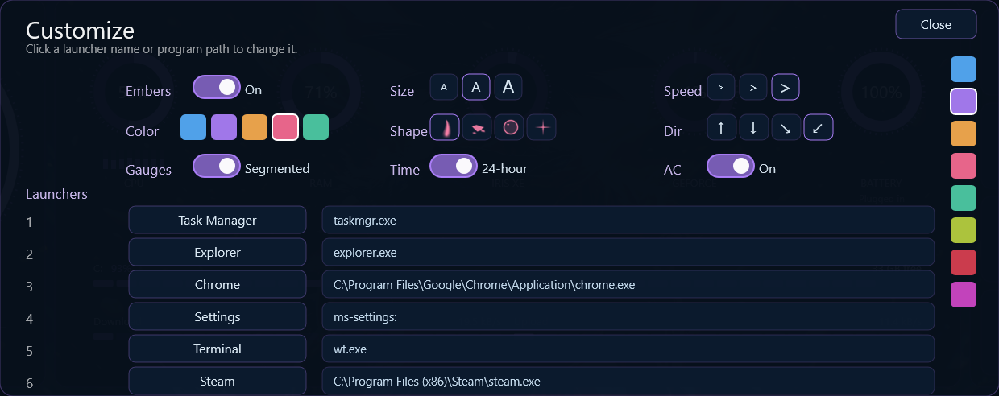

# ScreenPad dashboard

This folder is a Rainmeter skins directory. The skin that fills the ZenBook Duo ScreenPad is `Duo\Dashboard`. Rainmeter's stock `illustro` suite can stay installed beside it. Git does not track that folder.

The ScreenPad is the second display: 1920 by 515 pixels, with its top-left corner at virtual-screen position `0, 1080`. On every refresh the skin turns dragging and edge-snapping off, stays above the desktop, and moves itself to that corner. Those coordinates are `OriginX` and `OriginY` in `Duo\@Resources\Variables.inc`.

## The screen

Three glass cards sit on a slightly transparent dark wash, so the wallpaper shows through. Forty ember sprites drift over the cards. Invisible click targets are drawn last, so a click still reaches the card underneath an ember.

| Card | Position | What it shows |
| --- | --- | --- |
| Clock | left, 380 px | Weekday, digital time, seconds ring, date, CPU name |
| System | center, 1124 px | CPU, RAM, Iris Xe, GeForce, battery, disk, network |
| Launch | right, 360 px | App buttons, and optionally the two AC buttons |

Right-click anywhere on the skin for the same choices as the Customize panel. **Edit launchers** opens that panel on the skin. **Hide dashboard** (or the small minus on the clock card) shrinks the skin to a **Show dashboard** chip in the ScreenPad corner and unloads the ember layer, so the rest of that display is free. Click the chip to bring the dashboard and embers back without opening Rainmeter.



## Folder map

```
Duo\
  Dashboard\Dashboard.ini    clock, gauges, launchers, customize, hide chip
  Embers\Embers.ini          click-through ember layer (16ms, over the cards)
  Minimized\Minimized.ini    optional companion chip if the dashboard is unloaded
  @Resources\
    Variables.inc            saved choices and the Home Assistant token (not in git)
    Variables.inc.example    the same file with the token left blank
    Styles.inc               shared fonts and gauge/bar styles
    Gpu.lua                  splits GPU usage into Iris Xe and GeForce
    ToggleAc.ps1             runs one Home Assistant toggle script
    Embers\                  white sprites (petals, ashes, bubbles, stars)
    Fonts\ShareTechMono-Regular.ttf
docs\
  dashboard.png              the filled ScreenPad (minus on the clock)
  clock.png                  the clock card
  system.png                 the gauge card
  launch.png                 the launcher card
  customize.png              the in-skin Customize panel
  minimized.png              the Show dashboard chip
```

`#@#` in the skin means `Duo\@Resources\`.

## How the skin is built

`Dashboard.ini` is read from top to bottom.

1. **Measures** collect numbers and text. A `Time` measure reads the clock. A `CPU` measure reads a core. A `WebParser` measure downloads a Home Assistant state. Measures are invisible.
2. **Meters** draw. `Shape` meters are the cards, icons, and rings. `String` meters are the labels. `Roundline` meters are the circular gauges. `Bar` meters are the disk and network lines. `Image` meters are the embers.
3. A meter points at a measure with `MeasureName`. The text `%1` is that measure's value.
4. **Bangs** are the commands in square brackets, such as `[!Refresh]` or `[!SetVariable EmberOn 0]`. They run from a click, a hover, or a measure condition.
5. **Groups** let one bang update many meters. `Embers`, `Launch`, `Ac`, `Settings`, `GaugeSimple`, `GaugeMark`, `Main`, and `Restore` are the groups that matter. Hide dashboard hides `Main`, unloads `Duo\Embers`, and shows the restore chip; the chip refreshes the dashboard, which starts the ember layer again.
6. `#Name#` is a variable from `Variables.inc`. With `DynamicVariables=1`, the meter reads that variable again on each update instead of only when the skin loads.

`Duo\Embers` uses `Update=16`, so those sprites move every 16 milliseconds (about 62 frames a second, matching a 60 Hz ScreenPad as closely as a whole-millisecond interval can). That skin is click-through and Stay Topmost, so the embers drift over the cards without sharing the dashboard's draw pass. The drift math is scaled to that interval so they travel at the same speed, with a smaller move between frames. The dashboard also uses `Update=16` for the seconds ring, but most stats set `UpdateDivider=62` and refresh about once a second. Disk and battery are slower still.

Colors are written `red,green,blue` or `red,green,blue,alpha`, with each channel from 0 to 255.

## Clock

The time uses Share Tech Mono at 72 pt. Hours sit above the minutes, with two dots between them. `HourFormat` is `%H` for 24-hour time and `%I` for 12-hour time. `Time12=1` also shows AM/PM.



The ring around the time is the seconds hand, drawn as a round line. Seconds only run from 0 to 59, so a plain "percent of 60" gauge never quite closes. `MeasureSecondSweep` stretches 59 seconds to just under a full circle (`59.97 / 59`). At second 59 the ring meets itself. At second 0 it starts over. Do not change that formula to an exact 360 degrees. Direct2D drops a full circle and the ring disappears.

The font file is loaded only when Rainmeter itself starts, not when a skin is refreshed. After adding or changing a font in `@Resources\Fonts`, quit Rainmeter and open it again.

## System gauges

Five rings sit on the system card: CPU, RAM, Iris Xe, GeForce, and battery. They are `Roundline` meters. `styleRingTrack` and `styleRingValue` in `Styles.inc` are only the shared defaults: start angle, sweep, inner radius (`LineStart`), outer radius (`LineLength`), and color. Any one gauge can override those on its own meter. The ring thickness is `LineLength` minus `LineStart` (6 pixels on the 124-pixel gauges). The seconds ring sets its own radii in the clock section.



`Roundline` can only draw one solid arc. It cannot draw tick marks or a bar made of separate blocks. The ticks are short `Line` shapes placed on the circle. The disk and network bars are rows of rectangles. Do not rotate those tick lines with an anchor point: Rainmeter measures that anchor from the line itself, so the dots leave the center of the ring.

`GaugeStyle` picks which set is visible. `1` is the thin solid rings and the thin bars. `2` is the thicker rings, the tick marks, and the block bars. Right-click the skin and choose **Gauges: Simple** or **Gauges: Segmented**, or use the same buttons on the Customize panel. The percent in the middle of each ring stays either way. The seconds ring follows the same choice. The eight CPU core bars do not.

Iris Xe and the GeForce MX450 are not one Windows counter. `MeasureGpu1` through `MeasureGpu20` read GPU engine usage. `Gpu.lua` groups those engines by adapter id (LUID) and keeps the busiest engine for each card, clamped to 0–100.

The LUIDs in `Gpu.lua` are assigned at boot:

- Iris Xe: `0x0000ffc9`
- GeForce MX450: `0x00010890`

After a reboot those ids can change. If both GPU rings freeze at 0, or the wrong card gets the number, open Windows Performance Monitor or a `typeperf` GPU counter, find the new `luid_0x........` values, and update the two constants at the top of `Gpu.lua`. The MX450 also reports 0% while it is asleep. That is the driver, not a broken measure.

The disk bar is C: used space. Clicking it runs `explorer.exe C:` so Explorer opens the drive. A trailing backslash (`C:\`) escapes the quote and Explorer opens Documents instead. The network bars scale against `NetMax`, which is 100 MB/s. Battery opens Windows power settings.

## Hide and restore

The ScreenPad is a full Windows display. When you need it for something else, you should not have to open Rainmeter's Manage window.

- Click the small **minus** on the top-left of the clock card, or right-click the skin and choose **Hide dashboard**.
- The dashboard shrinks to a **Show dashboard** chip in that same corner. `Duo\Embers` unloads at the same time, so sprites do not keep drifting over the wallpaper.
- The rest of the 1920x515 display is then free for whatever you put there.
- Click **Show dashboard** to refresh the dashboard. That starts the ember layer again and puts it back over the cards.



Right-click **Edit launchers** still opens Customize. Opening that panel unloads the ember layer so the controls stay clickable and the Embers switch still records on/off. Closing the panel starts the layer again if the switch is on.

## Embers

Each ember is an `Image` meter in `Duo\Embers\Embers.ini`, in the `Embers` group. That config is a separate Rainmeter skin: 16ms updates, click-through, and Stay Topmost (`!ZPos 2`) so the sprites sit over the dashboard cards. The dashboard itself stays at Topmost (`!ZPos 1`). Do not set both skins to Stay Topmost; they would flicker. `EmberShape` picks the picture set, and `EmberPrefix` is the file name in front of `1.png` through `5.png`:

| Shape | `EmberShape` | Files |
| --- | --- | --- |
| Petals | 1 | `ember1.png` … `ember5.png` |
| Ashes | 2 | `ash1.png` … `ash5.png` |
| Bubbles | 3 | `bubble1.png` … `bubble5.png` |
| Stars | 4 | `star1.png` … `star5.png` |

Right-click the skin, or use the Shape buttons on the Customize panel. The pictures are white with a transparent edge. `ImageTint=#EmberTint#` multiplies that white by the ember color, which is why a tint change recolors them. If the PNGs were already blue, tinting could not turn them rose or amber.

Motion comes from `MeasureDrift`, a counter that never wraps, so the embers do not fall back into sync. `EmberDir` picks the path:

| Value | Motion |
| --- | --- |
| 1 | Rise, with a side-to-side sway |
| 2 | Fall, like petals |
| 3 | Diagonal, left to right, like snow |
| 4 | Diagonal, right to left |

`EmberScale` is `0.65` small, `1` medium, or `1.45` large. `EmberSpeed` is `1` a medium drift, `4` quicker, or `10` a storm. `EmberOn=0` hides the group.

`ImageRotate` is in degrees. A tiny fraction looks frozen because the sprite barely turns.

## Launchers

Six buttons launch a program named in `Variables.inc`:



| Slot | Default | Variable |
| --- | --- | --- |
| 1 | Task Manager | `Launch1Name` / `Launch1Path` |
| 2 | Explorer | `Launch2Name` / `Launch2Path` |
| 3 | Chrome | `Launch3Name` / `Launch3Path` |
| 4 | Settings | `Launch4Name` / `Launch4Path` |
| 5 | Terminal | `Launch5Name` / `Launch5Path` |
| 6 | Steam | `Launch6Name` / `Launch6Path` |

The icons are drawn with `Shape` meters (Rainmeter cannot load SVG). The click itself is a separate hit meter, `MeterBtn1Hit` through `MeterBtn6Hit`, placed after the embers.

`AcControls=1` shrinks those six buttons into four rows of two and adds Master and Kids on the bottom row. `AcControls=0` hides the AC buttons and restores the taller six-button grid. The height and row positions are formulas on the meters (`#AcControls# = 1 ? 106 : 145` and the matching Y values). Hover highlight is a second shape meter per button. Do not replace a cell's `Shape` with `!SetOption` and a variable from `Variables.inc`. Rainmeter expands that variable when the skin loads, and the button gets stuck at whichever size was current then.

## Air conditioners

Home Assistant is `HAHost` (`http://192.168.100.223:8123`). Two scripts toggle the units between cool and off:

- `script.master_ac_toggle` toggles `climate.master_ac`
- `script.kids_ac_toggle` toggles `climate.kids_ac`

A click runs `ToggleAc.ps1`, which reads the token from `Variables.inc` and calls `POST /api/services/script/turn_on`. The script only accepts those two entity ids.

The button label is the room temperature, from `current_temperature` on the climate entity. `MeasureMasterAc` and `MeasureKidsAc` download the state about every 10 seconds (`Update=16` times `UpdateRate=625`). `Flags=ForceReload` skips Windows' web cache, which otherwise keeps serving the old temperature. The highlighted button means that unit is on (cool, heat, fan, or auto). A plain button means it is off.

The token is a long-lived access token from your Home Assistant profile, under Security. It is a password for the whole Home Assistant account. It lives only in `Variables.inc`, which git does not track. Replacing it does not require a code change. After a bad token, the temperatures stop updating and a click does nothing useful. Create a new token and paste it into `HAToken=`.

## Customize



Right-click the skin, or open **Edit launchers**. Accent colors are an unlabeled vertical stack of squares on the right. Those settings sit in a centered three-column grid: Embers, Size, and Speed on top; Color, Shape, and Dir in the middle; Gauges, Time, and AC on the bottom. Each grid row has extra space above it. A switch that is on means embers are shown, the AC buttons are shown, the clock is 24-hour, or the gauges are segmented. Off hides the embers, hides the AC buttons, uses 12-hour time, or uses the simple gauges. Choices that only change a number (`EmberScale`, `EmberSpeed`, `EmberDir`, `EmberOn`, `EmberShape`, `AcControls`, `GaugeStyle`, 12/24-hour time) apply immediately with `!SetVariable`. Color choices rewrite `Accent`, `AccentHot`, `AccentDim`, the icon colors, or `EmberTint`, then refresh the skin, because those colors are baked into styles and shapes at load.

| Pick | Accent | Ember tint |
| --- | --- | --- |
| 1 Ice | 88, 176, 255 | 150, 205, 255 |
| 2 Violet | 176, 130, 255 | 190, 150, 255 |
| 3 Amber | 255, 176, 80 | 255, 186, 90 |
| 4 Rose | 255, 110, 150 | 255, 130, 170 |
| 5 Mint | 80, 210, 170 | 110, 230, 190 |
| 6 Lime | 190, 214, 64 | |
| 7 Crimson | 224, 64, 82 | |
| 8 Magenta | 214, 72, 204 | |

Ember color uses the first five only. Lime, crimson, and magenta change the accent and the launcher icons.

Launcher names and paths are edited in the panel. The field writes straight back to `Variables.inc` and updates the button, without a full refresh.

`SettingsOpen=1` makes the panel show itself again after a refresh. Closing the panel sets it back to 0.

## Editing without breaking the files

`Dashboard.ini` and `Variables.inc` are UTF-16 LE (byte order mark `FF FE`). `Gpu.lua` and `ToggleAc.ps1` are UTF-8 without a byte order mark. Saving the ini files as UTF-8, or letting a tool rewrite them as ANSI, wipes the skin. If the dashboard suddenly vanishes after a save, the encoding was lost. Restore the file from git and edit it as Unicode.

```
git restore Duo/Dashboard/Dashboard.ini Duo/@Resources/Styles.inc
```

That puts the code back to the last commit. It does not touch `Variables.inc`, so the token and your saved colors, launchers, and ember choices stay as they are. `git status` will not list `Variables.inc` because `.gitignore` excludes it.

`Variables.inc.example` is the same settings with `HAToken` empty. On a new copy of this folder, copy that file to `Variables.inc`. The clock, gauges, embers, and launchers work immediately. The AC buttons need a token pasted into `HAToken`, and they need Home Assistant at `HAHost`.

Rainmeter's own config, `%AppData%\Rainmeter\Rainmeter.ini`, is also UTF-16. Do not rewrite it with a normal text save.

To see a change: right-click the skin and choose Refresh, or run:

```
"C:\Program Files\Rainmeter\Rainmeter.exe" !Refresh "Duo\Dashboard"
```

In PowerShell the bang must be quoted. An unquoted `!Refresh` is treated as "not Refresh" and the command fails.

## Where to change something

| You want to… | Look at |
| --- | --- |
| Move the skin to another corner | `OriginX`, `OriginY` |
| Recolor the interface | `Accent`, `AccentHot`, `AccentDim` in `Variables.inc`, or the menu |
| Switch solid or segmented gauges, disk, and network | right-click **Gauges**, or `GaugeStyle` in `Variables.inc` |
| Change gauge thickness or font | `Styles.inc` |
| Fix a GPU ring after a reboot | the LUIDs at the top of `Gpu.lua` |
| Point a button at another program | Customize panel, or `Launch1Path` … `Launch6Path` |
| Add or retint an ember | `Duo\Embers\Embers.ini`, and the PNGs |
| Change what the AC buttons call | `ToggleAc.ps1` and the `climate.*` URLs in `Dashboard.ini` |
| Hide or restore the dashboard | minus on the clock, or right-click **Hide dashboard**; the **Show dashboard** chip restores it |
